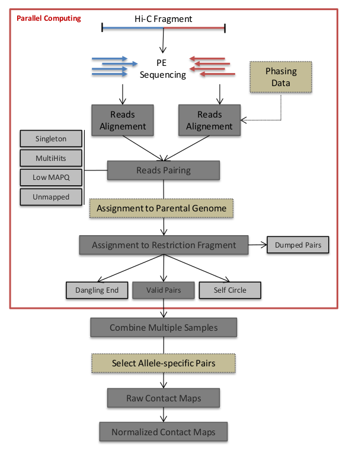

## HiC-Pro Manual

### Building the annotation Files

In order to process the raw data, HiC-Pro requires three annotation files. Note that the pipeline is provided with some Human and Mouse annotation files.  
**Please be sure that the chromosome names are the same than the ones used in your bowtie indexes !**

- **A BED file** of the restriction fragments after digestion. This file depends both of the restriction enzyme and the reference genome. See the [FAQ](doc/FAQ.md) and the [HiC-Pro utilities](doc/UTILS.md) for details about how to generate this file. A few annotation files are provided with the HiC-Pro sources as examples.

```
   chr1   0       16007   HIC_chr1_1    0   +
   chr1   16007   24571   HIC_chr1_2    0   +
   chr1   24571   27981   HIC_chr1_3    0   +
   chr1   27981   30429   HIC_chr1_4    0   +
   chr1   30429   32153   HIC_chr1_5    0   +
   chr1   32153   32774   HIC_chr1_6    0   +
   chr1   32774   37752   HIC_chr1_7    0   +
   chr1   37752   38369   HIC_chr1_8    0   +
   chr1   38369   38791   HIC_chr1_9    0   +
   chr1   38791   39255   HIC_chr1_10   0   +
   (...)
```

- **A table file** of chromosomes' size. This file can be easily find on the UCSC genome browser. Of note, pay attention to the contigs or scaffolds, and be aware that HiC-pro will generate a map per chromosomes pair. For model organisms such as Human or Mouse, which are well annotated, we usually recommand to remove all scaffolds.  

```
   chr1    249250621
   chr2    243199373
   chr3    198022430
   chr4    191154276
   chr5    180915260
   chr6    171115067
   chr7    159138663
   chr8    146364022
   chr9    141213431
   chr10   135534747
   (...)
```

- **The bowtie2 indexes**. See the [bowtie2 manual page](http://bowtie-bio.sourceforge.net/bowtie2/index.shtml) for details about how to create such indexes.


### Setting the configuration file

Copy and edit the configuration file *'config-hicpro.txt'* in your local folder. The '[]' options are optional and can be undefined.

| SYSTEM         |                                                                                                                      |
|----------------|----------------------------------------------------------------------------------------------------------------------|
| N_CPU          | Number of CPU allows per job                                                                                         |
| SORT_RAM       | The memory for samtools sort (in Mo). Note that this number will be divided by the N_CPU to have a memory per thread |
| LOGFILE        | Name of the main log file                                                                                            |
| [JOB_NAME  ]   | Name of the job on the custer                                                                                        |
| [JOB_MEM]      | Memory (RAM) required per job                                                                                        |
| [JOB_WALLTIME] | WallTime allows per job                                                                                              |
| [JOB_MAIL]     | User mail for PBS/Torque report                                                                                      |

----------------

| READS ALIGNMENT OPTIONS|                                                                                                                     |
|------------------------|---------------------------------------------------------------------------------------------------------------------|
| RAW_DIR                | Link to rawdata folder. The user usually not need to change this option. *Default: rawdata*                         |
| PAIR1_EXT              | Keyword for first mate detection. *Default: _R1*                                                                     |
| PAIR2_EXT              | Keywoard for seconde mate detection. *Default: _R2*                                                                  |
| FORMAT                 | Sequencing qualities encoding. *Default: phred33*                                                                   |
| MIN_MAPQ               | Minimum mapping quality. Reads with lower quality are discarded. *Default: 0*                                       |
| BOWTIE2_IDX_PATH       | Path to bowtie2 indexes                                                                                             |
| BOWTIE2_GLOBAL_OPTIONS | bowtie2 options for mapping step1. *Default: --very-sensitive -L 30 --score-min L,-0.6,-0.2 --end-to-end --reorder* |
| BOWTIE2_LOCAL_OPTIONS  | bowtie2 options for mapping step2. *Default: --very-sensitive -L 20 --score-min L,-0.6,-0.2 --end-to-end --reorder* |

----------------

| ANNOTATION FILES      |                                                                                                                                              |
|-----------------------|----------------------------------------------------------------------------------------------------------------------------------------------|
| REFERENCE_GENOME      | Reference genome prefix used for genome indexes. *Default: hg19*                                                                             |
| GENOME_SIZE           | Chromsome size file. Loaded from the ANNOTATION folder in the HiC-Pro installation directory. *Default: chrom_hg19.sizes*                    |
| [CAPTURE_TARGET]      | BED file of target regions to focus on (mainly used for capture Hi-C data)                                                                   |
| [ALLELE_SPECIFIC_SNP] | VCF file (.vcf or .vcf.gz) to SNPs which can be used to distinguish parental origin. See the [allele specific section]( AS.md) for details   |

----------------

| ALLLELE SPECIFIC ANALYSIS |                                                                                                                                  |
|---------------------------|----------------------------------------------------------------------------------------------------------------------------------|
| [ALLELE_SPECIFIC_SNP]     | VCF file to SNPs which can be used to distinguish parental origin. See the [allele specific section](AS.md) for details     |

----------------

| CAPTURE Hi-C              |                                                                                                     |
|---------------------------|-----------------------------------------------------------------------------------------------------|
| [CAPTURE_TARGET]          | BED file of target regions to focus on (mainly used for capture Hi-C data)                          |
| [REPORT_CAPTURE_REPORTER] | Report interactions between targeted and non-targeted loci (=1) and between targeted loci only (=0) |

----------------

| DIGESTION Hi-C        |                                                                                                                                          |
|-----------------------|------------------------------------------------------------------------------------------------------------------------------------------|
| [GENOME_FRAGMENT]     | BED file with restriction fragments. Full path or name of file available in the ANNOTATION folder. *Default: HindIII_resfrag_hg19.bed*   |
| [LIGATION SITE]       | Ligation site sequence(s) used for reads trimming. Depends on the fill in strategy. Note that multiple ligation sites can be specified (comma separated). *Example: AAGCTAGCTT*                                   |
| [MIN_FRAG_SIZE]       | Maximum size of restriction fragments to consider for the Hi-C processing. *Example: 100*                                                |
| [MAX_FRAG_SIZE]       | Maximum size of restriction fragments to consider for the Hi-C processing. *Example: 100000*                                             |
| [MIN_INSERT_SIZE]     | Minimum sequenced insert size. Shorter 3C products are discarded. *Example: 100*                                                         |
| [MAX_INSERT_SIZE]     | Maximum sequenced insert size. Larger 3C products are discarded. *Example: 600*                                                          |

----------------

| Hi-C PROCESSING             |                                                                                                                         |
|-----------------------------|-------------------------------------------------------------------------------------------------------------------------|
| [MIN_CIS_DIST]              | Filter short range contact below the specified distance. Mainly useful for DNase Hi-C. *Example: 1000*                  |
| GET_ALL_INTERACTION_CLASSES | Create output files with all classes of 3C products. *Default: 0*                                                       |
| GET_PROCESS_BAM             | Create a BAM file with all aligned reads flagged according to their classifaction and mapping category. *Default: 0*    |
| RM_SINGLETON                | Remove singleton reads. *Default: 1*                                                                                    |
| RM_MULTI                    | Remove multi-mapped reads. *Default: 1*                                                                                 |
| RM_DUP                      | Remove duplicated reads' pairs. *Default: 1*                                                                            |

----------------

| GENOME-WIDE CONTACT MAPS    |                                                                                                                         |
|-----------------------------|-------------------------------------------------------------------------------------------------------------------------|
| BIN_SIZE                    | Resolution of contact maps to generate (space separated). *Default: 20000 40000 150000 500000 1000000*                  |
| BIN_STEP                    | Binning step size in ‘n’ coverage _i.e._ window step. *Default: 1*                                                      |
| MATRIX_FORMAT               | Output matrix format. Must be complete, upper. *Default: upper*. *Deprecated: asis, lower*                              |

----------------

| NORMALIZATION                     |                                                                                                                         |
|-----------------------------------|-------------------------------------------------------------------------------------------------------------------------|
| MAX_ITER                          | Maximum number of iteration for ICE normalization. *Default: 100*                                                       |
| SPARSE_FILTERING - **deprecated** | Define which pourcentage of bins with high sparsity should be force to zero. *Default: 0.02*                            |
| FILTER_LOW_COUNT_PERC             | Define which pourcentage of bins with low counts should be force to zero. *Default: 0.02*. Replace SPARSE_FILTERING     |
| FILTER_HIGH_COUNT_PERC            | Define which pourcentage of bins with low counts should be discarded before normalization. *Default: 0*                 |
| EPS                               | The relative increment in the results before declaring convergence. *Default: 0.1*                                      |


## Containers

### Bulid a `conda` environment
                                                                                                                                                                                      
In order to ease the installation of HiC-Pro dependancies, we provide a `.yml` file for conda with all required tools.
In order to build your conda environment, first install [miniconda](https://docs.conda.io/en/latest/miniconda.html) and use :

```
conda env create -f MY_INSTALL_PATH/HiC-Pro/environment.yml -p WHERE_TO_INSTALL_MY_ENV
conda activate WHERE_TO_INSTALL_MY_ENV
```

### Using the HiC-Pro `Docker` image

A docker image is automatically build and available on [Docker Hub](https://hub.docker.com/repository/docker/nservant/hicpro)
To pull a Docker image, simply use :

```
docker pull nservant/hicpro:latest
```

Note that the `tag` may depend on the HiC-Pro version.

You can also build your own image from the root folder using

```
docker build -t hicpro:3.0.0 .
```


### Run HiC-Pro through `Singularity`

HiC-Pro provides a Singularity container to ease its installation process.
A ready-to-use container is available [here](https://zerkalo.curie.fr/partage/HiC-Pro/singularity_images/hicpro_latest_ubuntu.img).

In order to build you own Singularity image;

1- Install singularity

- Linux : http://singularity.lbl.gov/install-linux
- MAC : http://singularity.lbl.gov/install-mac
- Windows : http://singularity.lbl.gov/install-windows

2- Build the singularity HiC-Pro image using the 'Singularity' file available in the HiC-Pro root directory.

```
sudo singularity build hicpro_latest_ubuntu.img MY_INSTALL_PATH/HiC-Pro/Singularity
```

3- Run HiC-pro

You can then either use HiC-Pro using the 'exec' command ;

```
singularity exec hicpro_latest_ubuntu.img HiC-Pro -h
```

Or directly use HiC-Pro within the Singularity shell

```
singularity shell hicpro_latest_ubuntu.img
HiC-Pro -h
```

## Run HiC-Pro in standalone/cluster mode

Once the configuration is set, put all input files in a rawdata folder. The input files have to be organized with **one folder per sample**, such as;

```
   + PATH_TO_MY_DATA
     + sample1
       ++ file1_R1.fastq.gz
       ++ file1_R2.fastq.gz
       ++ ...
     + sample2
       ++ file1_R1.fastq.gz
       ++ file1_R2.fastq.gz
     *...
```

- Run HiC-Pro on your laptop in standalone model

```
    MY_INSTALL_PATH/bin/HiC-Pro -i FULL_PATH_TO_DATA_FOLDER -o FULL_PATH_TO_OUTPUTS -c MY_LOCAL_CONFIG_FILE
```

  - Run HiC-Pro on a cluster (TORQUE/SGE/SLURM/LSF)

```
   MY_INSTALL_PATH/bin/HiC-Pro -i FULL_PATH_TO_DATA_FOLDER -o FULL_PATH_TO_OUTPUTS -c MY_LOCAL_CONFIG_FILE -p
```

In the latter case, you will have the following message :

```
  Please run HiC-Pro in two steps :
  1- The following command will launch the parallel workflow through 12 torque jobs:
  qsub HiCPro_step1.sh
  2- The second command will merge all outputs to generate the contact maps:
  qsub HiCPro_step2.sh
```

Execute the displayed command from the output folder:

```
  qsub HiCPro_step1.sh
```

Once executed succesfully (may take several hours), run the step using:

```
  qsub HiCPro_step2.sh
```


### Run HiC-Pro in sequential mode

HiC-Pro can be run in a step-by-step mode.
Available steps are described in the help command.

```
HiC-Pro --help
usage : HiC-Pro -i INPUT -o OUTPUT -c CONFIG [-s ANALYSIS_STEP] [-p] [-h] [-v]
Use option -h|--help for more information

HiC-Pro 2.11.0
---------------
OPTIONS

 -i|--input INPUT : input data folder; Must contains a folder per sample with input files
 -o|--output OUTPUT : output folder
 -c|--conf CONFIG : configuration file for Hi-C processing
 [-p|--parallel] : if specified run HiC-Pro on a cluster
 [-s|--step ANALYSIS_STEP] : run only a subset of the HiC-Pro workflow; if not specified the complete workflow is run
    mapping: perform reads alignment - require fast files
    proc_hic: perform Hi-C filtering - require BAM files
    quality_checks: run Hi-C quality control plots
    merge_persample: merge multiple inputs and remove duplicates if specified - require .validPairs files
    build_contact_maps: Build raw inter/intrachromosomal contact maps - require _allValidPairs files
    ice_norm : run ICE normalization on contact maps - require .matrix files
 [-h|--help]: help
```

As an exemple, if you want to only want to only align the sequencing reads and run a quality control, use :

```
MY_INSTALL_PATH/bin/HiC-Pro -i FULL_PATH_TO_RAW_DATA -o FULL_PATH_TO_OUTPUTS -c MY_LOCAL_CONFIG_FILE -s mapping -s quality_checks
```

Note that in sequential mode, the INPUT argument depends on the analysis step. See the [user's cases](USERCASES.md) for examples.

| STEPWISE MODE         | INPUT DATA TYPE    |
|-----------------------|--------------------|
|  -s mapping           | .fastq(.gz) files  |
| -s proc_hic           | .bam files         |
| -s quality_checks     | .bam files         |
| -s merge_persample    | .validPairs files  |
| -s build_contact_maps | .validPairs files  |
| -s ice_norm           | .matrix files      |

### How does HiC-Pro work ?

The HiC-Pro workflow can be divided in five main steps presented below.




1. **Reads Mapping**

Each mate is independantly aligned on the reference genome. The mapping is performed in two steps. First, the reads are aligned using an end-to-end aligner. Second, reads spanning the ligation junction are trimmmed from their 3' end, and aligned back on the genome. Aligned reads for both fragment mates are then paired in a single paired-end BAM file. Singletons and multi-hits can be discarded according the confirguration parameters. Note that if if the *LIGATION_SITE* parameter in the not defined, HiC-Pro will skip the second step of mapping.

2. **Fragment assignment and filtering**

Each aligned reads can be assigned to one restriction fragment according to the reference genome and the restriction enzyme.  
The next step is to separate the invalid ligation products from the valid pairs.  
Here is the list of pairs classified as invalid by HiC-Pro :  

* Dangling end, i.e. unligated fragments (both reads mapped on the same restriction fragment)
* Self circles, i.e. fragments ligated on themselves (both reads mapped on the same restriction fragment in inverted orientation
* Religation, i.e. ligation of juxtaposed fragments
* Dumped pairs, i.e. any pairs that do not match the filtering criteria on inserts size, restriction fragments size or for which we were not able to reconstruct the ligation product.

Only valid pairs involving two different restriction fragments are used to build the contact maps. Duplicated valid pairs associated to PCR artefacts are discarded.
The fragment assignment can be visualized through a BAM files of aliged pairs where each pair is flagged according to its classification.  
In case of Hi-C protocols that do not require a restriction enzyme such as DNase Hi-C or micro Hi-C, the assignment to a restriction is not possible. If no *GENOME_FRAGMENT* file are specified, this step is ignored. Short range interactions can however still be discarded using the *MIN_CIS_DIST* parameter.

3. **Quality Controls**

HiC-Pro performs a couple of quality controls for most of the analysis steps. The alignment statistics are the first quality controls. Aligned reads in the first (end-to-end) step, and alignment after trimming are reported. Note that in pratice, we ususally observed around 10-20% of trimmed reads. An abnormal level of trimmed reads can reflect a ligation issue.  
Once the reads are aligned on the genome, HiC-pro checks the number of singleton, multiple hits or duplicates. The fraction of valid pairs are presented for each type of ligation products. Invalid pairs such as dangling and or self-circle are also represented. A high level of dangling ends, or an imbalance in valid pairs ligation type can be due to a ligation, fill-in or digestion issue.  
Finally HiC-Pro also calculated the distribution of fragment size on a subset of valid pairs. Additional statistics will report the fraction of intra/inter-chromosomal contacts, as well as the proportion of short range (<20kb) versus long range (>20kb) contacts.

4. **Map builder**

Intra et inter-chromosomal contact maps are build for all specified resolutions. The genome is splitted into bins of equal size. Each valid interaction is associated with the genomic bins to generate the raw maps.

5. **ICE normalization**

Hi-C data can contain several sources of biases which has to be corrected. HiC-Pro proposes a fast implementation of the original ICE normalization algorithm (Imakaev et al. 2012), making the assumption of equal visibility of each fragment. The ICE normalization can be used as a standalone python package through the [iced python package](https://github.com/hiclib/).


### Browsing the results

All outputs follow the input organization, with one folder per sample.
See the [results](RES.md) section for more information.

* *bowtie_results*

The *bowtie_results* folder contains the results of the reads mapping. The results of first mapping step are available in the *bwt2_glob* folder, and the seconnd step in the *bwt2_loc* folder. Final BAM files, reads pairing, and mapping statistics are available on the *bwt2* folder. Note that once HiC-Pro has been run, all files in *bwt2_glob* or *bwt2_loc* folders can be removed. These files take a significant amount of disk space and are not useful anymore.

* *hic_results*

This folder contains all Hi-C processed data, and is further divided in several sub-folders.

The *data* folder is used to store the valid interaction products (*.validPairs*), as well as other statisics files.

The *validPairs* are stored using a simple tab-delimited text format ;
read name / chr_reads1 / pos_reads1 / strand_reads1 / chr_reads2 / pos_reads2 / strand_reads2 / fragment_size [/ allele_specific_tag]
One *validPairs* file is generated per reads chunck. These files are then merged in the *allValidPairs*, and duplicates are removed if specified in the configuration file.

The contact maps are then available in the *matrix* folder. The *matrix* folder is organized with *raw* and *iced* contact maps for all resolutions.
Contact maps are stored as a triplet sparse format ;
bin_i / bin_j / counts_ij
Only no zero values are stored. BED file described the genomic bins are also generated. Note that *abs* and *ord* files are identical in the context of Hi-C data as the contact maps are symmetric.

Finally, the *pic* folder contains graphical outputs of the quality control checks.
